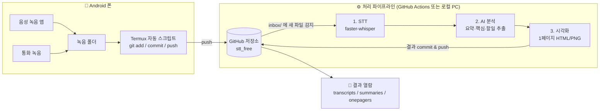
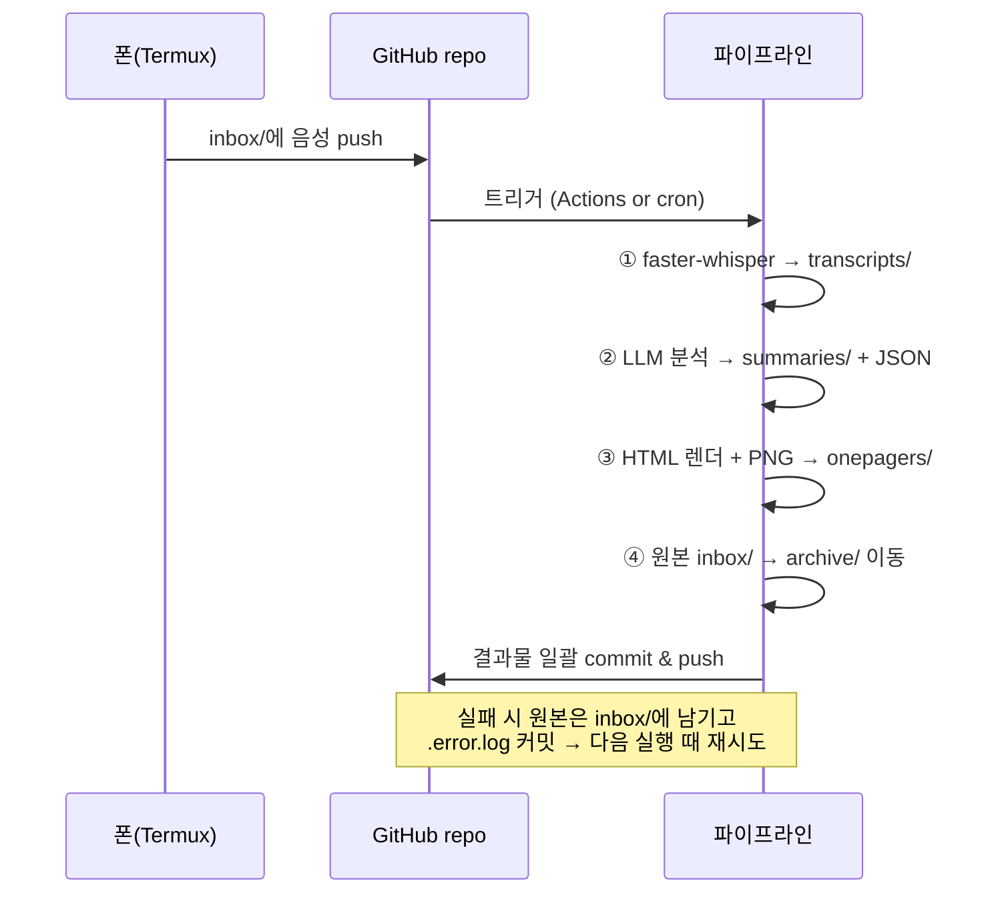

# stt_free 설계 문서

Android 폰의 음성 녹음/통화 녹음 파일을 git 저장소에 넣으면,
자동으로 **음성 인식(STT) → AI 요약 → 1페이지 시각 자료** 까지 만들어주는 파이프라인.

"free" 원칙: 가능한 한 무료 도구(로컬 Whisper, GitHub Actions 무료 티어)로 구성하고,
유료 API(Claude 등)는 선택 가능한 플러그인 형태로 둔다.

---

## 1. 전체 아키텍처



핵심 아이디어: **git 저장소 자체가 큐(queue)이자 결과 보관소**다.

- `inbox/` 에 음성 파일이 commit 되면 → 파이프라인이 돌고
- 결과물(`transcripts/`, `summaries/`, `onepagers/`)이 다시 commit 되며
- 처리 완료된 원본은 `archive/` 로 이동한다.

---

## 2. 디렉토리 구조

```
stt_free/
├── inbox/                  # 폰에서 push 되는 새 음성 파일 (처리 대기)
│   └── 2026-07-19_1030_call_홍길동.m4a
├── archive/                # 처리 완료된 원본 음성 (연/월별 정리)
│   └── 2026/07/...
├── transcripts/            # STT 결과 (타임스탬프 포함 전문)
│   └── 2026-07-19_1030_call_홍길동.md
├── summaries/              # AI 요약 (핵심 내용, 결정 사항, 할 일)
│   └── 2026-07-19_1030_call_홍길동.md
├── onepagers/              # 1페이지 시각 정리 (HTML + PNG)
│   ├── 2026-07-19_1030_call_홍길동.html
│   └── 2026-07-19_1030_call_홍길동.png
├── pipeline/               # 파이프라인 코드 (Python)
│   ├── run.py              # 엔트리포인트: inbox 스캔 → 전체 단계 실행
│   ├── stt.py              # faster-whisper 래퍼
│   ├── analyze.py          # LLM 요약/분석
│   ├── onepager.py         # HTML 템플릿 렌더링 + PNG 변환
│   └── config.yaml         # 모델, 언어, LLM 백엔드 선택 등
├── phone/                  # 폰(Termux) 쪽 스크립트
│   └── auto_push.sh
├── .github/workflows/
│   └── process.yml         # inbox 변경 시 자동 실행
└── DESIGN.md
```

### 파일명 규칙

```
{YYYY-MM-DD}_{HHMM}_{종류}_{상대·주제}.{확장자}
예) 2026-07-19_1030_call_홍길동.m4a
    2026-07-19_1400_memo_회의아이디어.m4a
```

- 종류: `call`(통화) / `memo`(음성 메모)
- 폰 스크립트가 파일의 수정 시각으로 자동 rename (상대/주제는 없으면 생략)
- 모든 산출물은 원본과 같은 베이스 이름을 공유 → 원본↔결과 추적이 쉬움

### 상태 관리

별도 DB 없이 **파일 위치가 곧 상태**:

| 상태 | 위치 |
|---|---|
| 처리 대기 | `inbox/` |
| 처리 완료 | `archive/` + 산출물 3종 존재 |
| 처리 실패 | `inbox/` 에 남고 `inbox/{이름}.error.log` 생성 |

---

## 3. 컴포넌트별 설계

### 3-1. 폰 (수집 & 업로드) — Termux

- **Termux + termux-job-scheduler**(또는 Tasker 연동)로 주기 실행
- `phone/auto_push.sh` 동작:
  1. 녹음 앱 폴더(예: `/sdcard/Recordings`, 통화녹음 폴더)에서 새 파일 탐지
  2. 파일명 규칙으로 rename 후 저장소의 `inbox/` 로 복사
  3. `git add → commit → push` (SSH deploy key 사용)
- 대안: Termux가 번거로우면 **FolderSync/Syncthing 으로 PC에 동기화 → PC가 commit** 하는 우회 경로도 가능 (파이프라인은 동일)

### 3-2. 저장소 (GitHub)

- 음성 파일은 바이너리이므로 **Git LFS 권장** (GitHub 무료 1GB 저장/월 1GB 대역폭)
- LFS를 피하고 싶으면: 처리 완료 후 원본을 `archive/` 이동 대신 **로컬 백업 후 저장소에서 삭제**하는 정책도 config로 선택 가능
- 개인 녹음이므로 **private 저장소 필수** (통화 녹음은 민감 정보)

### 3-3. STT — faster-whisper (무료, 로컬 추론)

- OpenAI Whisper의 CTranslate2 구현체. CPU에서도 실용적 속도
- 한국어 인식 품질 양호. 모델 크기는 config로 선택:
  - GitHub Actions(CPU 2코어): `small` 또는 `medium`
  - 로컬 PC(GPU 있으면): `large-v3`
- 출력: 타임스탬프 있는 세그�먼트 → `transcripts/*.md`
  ```markdown
  # 2026-07-19 10:30 통화 — 홍길동
  - 길이: 12분 34초 / 모델: medium
  ---
  [00:00] 여보세요 ...
  [00:15] 네 지난번에 말씀하신 건은 ...
  ```

### 3-4. AI 분석 — 백엔드 교체 가능 구조

`analyze.py` 는 프롬프트 하나로 아래를 한 번에 뽑아 `summaries/*.md` 생성:

- **3줄 요약**
- **핵심 내용** (bullet)
- **결정 사항 / 합의 내용**
- **할 일 (action items)** — 담당·기한이 언급됐으면 포함
- **1페이지 시각화용 구조 데이터(JSON)** — 다음 단계 입력

LLM 백엔드는 config에서 선택:

| 백엔드 | 비용 | 비고 |
|---|---|---|
| `claude` (Claude API) | 유료 | 품질 최상. Haiku면 저렴 |
| `claude-code` (`claude -p` 헤드리스) | 구독 내 | 로컬 PC 처리 시 추가 비용 없음 |
| `gemini` (무료 티어) | 무료 | 하루 요청 제한 내 개인용 충분 |
| `ollama` (로컬 LLM) | 무료 | 완전 오프라인. 품질은 모델에 따라 |

### 3-5. 1페이지 시각화 — HTML 템플릿 → PNG

- 분석 단계가 만든 JSON을 **HTML 원페이저 템플릿**(Jinja2)에 렌더링
  - 상단: 제목·날짜·참여자·길이
  - 좌측: 3줄 요약 + 핵심 내용
  - 우측: 결정 사항 + 할 일 체크리스트
  - 하단: 대화 흐름 타임라인 (주요 구간 타임스탬프)
- `playwright` (headless chromium)로 HTML → PNG 스크린샷
- HTML은 그대로 폰 브라우저에서도 열람 가능

### 3-6. 파이프라인 실행 위치 — 두 가지 모드

| | A. GitHub Actions (기본) | B. 로컬 PC |
|---|---|---|
| 트리거 | `inbox/**` push 시 자동 | cron 또는 수동 `uv run python pipeline/run.py` |
| 비용 | 무료 티어 (private repo 월 2,000분) | 전기세 |
| STT 속도 | CPU라 느림 (10분 녹음 ≈ 수 분) | GPU면 빠름 |
| LLM | `gemini` 무료 티어 (API 키만 필요, 과금 없음) | `claude-code`(`claude -p`, Claude Code 구독 내 무료) 권장 |
| 장점 | PC 안 켜도 됨. 완전 자동, $0 | 무료·Claude Code 품질·프라이버시 |

둘 다 같은 `pipeline/run.py` 를 실행하므로 언제든 전환 가능. **API 과금을 원치 않으므로
`claude`(유료 API) 백엔드는 기본적으로 사용하지 않는다** — 로컬은 `claude-code`(Claude Code 구독),
Actions는 `gemini`(무료 티어)로 분리해 어느 경로로 처리해도 추가 비용이 들지 않게 한다.
**민감한 통화 녹음이 많다면 B(로컬) 모드를 권장** — 음성이 외부 러너에 올라가지 않음.

---

## 4. 처리 흐름 (한 파일 기준)



- 멱등성: 산출물 3종이 이미 있으면 해당 파일은 skip → 재실행 안전
- 동시 실행 방지: Actions `concurrency` 그룹 / 로컬은 lock 파일

---

## 5. 구현 로드맵

1. **Phase 1 — 코어 파이프라인 (로컬 수동)**
   `pipeline/` 구현: 음성 파일 하나를 넣고 `run.py` 로 전문·요약·원페이저까지 생성 확인
2. **Phase 2 — 자동화**
   GitHub Actions 워크플로 + LFS 설정, inbox push → 결과 commit 자동화
3. **Phase 3 — 폰 연동**
   Termux `auto_push.sh` + 주기 실행 설정
4. **Phase 4 — 개선**
   화자 분리(pyannote), 다건 일괄 처리 리포트, 월간 인덱스 페이지 등

---

## 6. 주의 사항

- **프라이버시**: 통화 녹음은 민감 정보. private repo + (권장) 로컬 처리 모드
- **법적**: 통화 녹음의 저장·전송은 상대방 동의 등 관할 법규 확인 필요
- **용량**: Git LFS 무료 한도(1GB) 초과 시 원본 삭제 정책으로 전환
